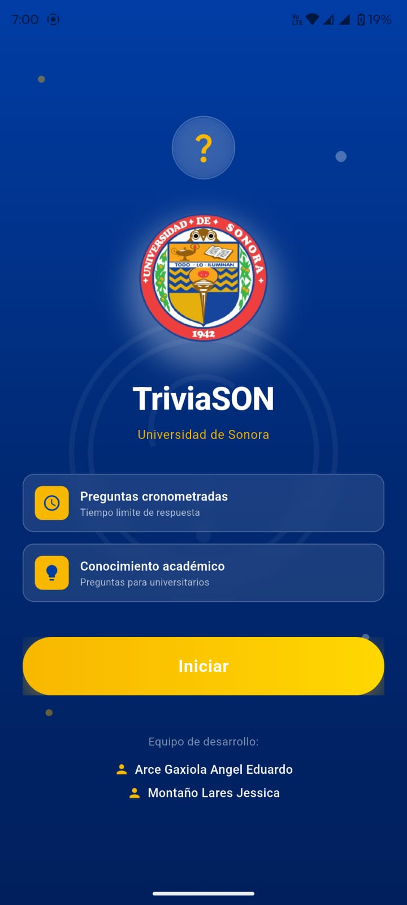
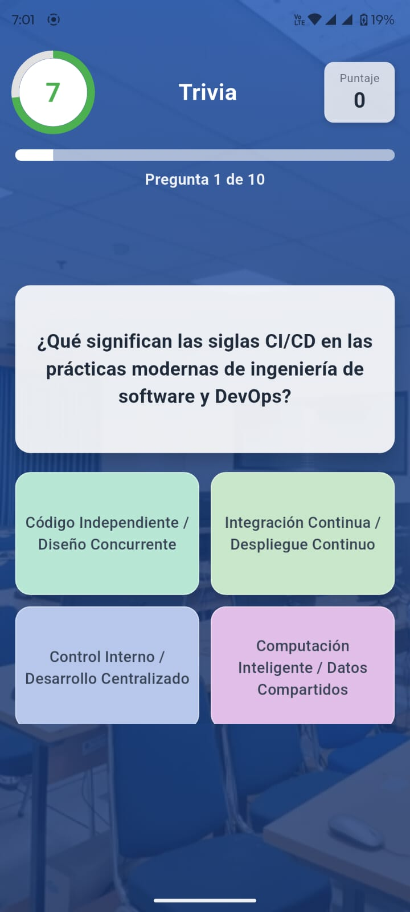
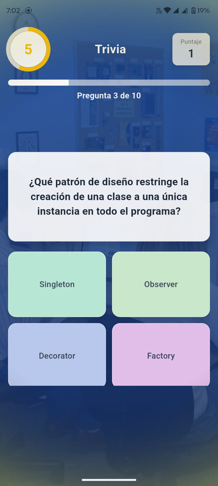
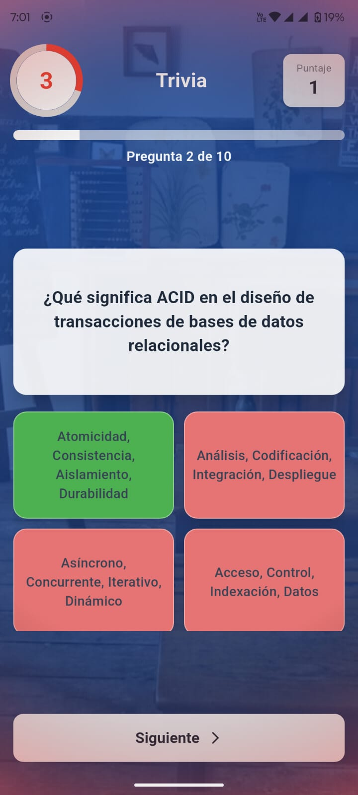
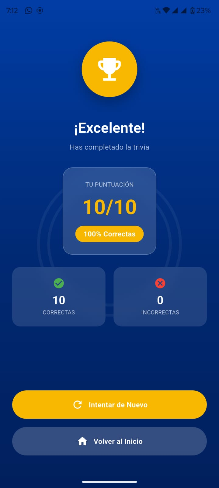
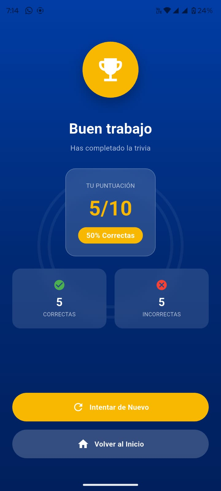
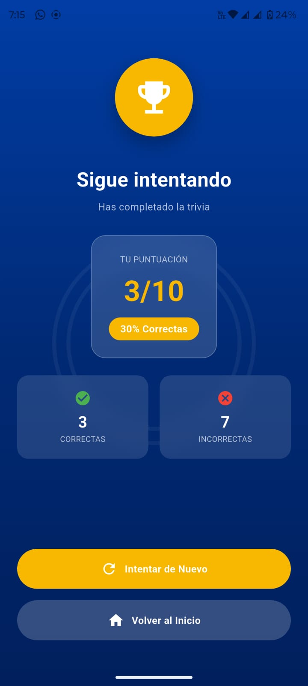

# trivia

Aplicación móvil desarrollada en Flutter que permite a los usuarios, responder preguntas tipo trivia con límite, acumulando puntuación según las respuestas correctas. La aplicación incluye efectos visuales dinámicos, temporizador interactiivo y una pantalla de resultados al finalizar la trivia.

Caracteristicas:

- Preguntas tipo trivia con 4 opciones de respuesta
- Temporizador por pregunta
- Indicador visual de tiempo restante
- Sistema de puntuación automatica
- Pantalla de resultados al finalizar la trivia
- Fondos dinámicos que cambian en cada pregunta
- Efectos visuales de alerta cuando el tiempo se está agootando

Tecnologias:

- Flutter Flutter 3.41.0 • channel stable • https://github.com/flutter/flutter.git
- Tools • Dart 3.11.0 • DevTools 2.54.1

Dependencias utilizadas:

- Cupertino_icons 1.0.8
- flutter_launcher_icons 0.14.4

  

Imagenes:

  
  
  
  

  
  
  

